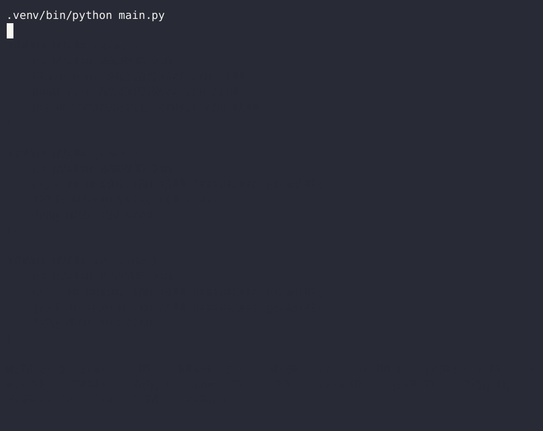
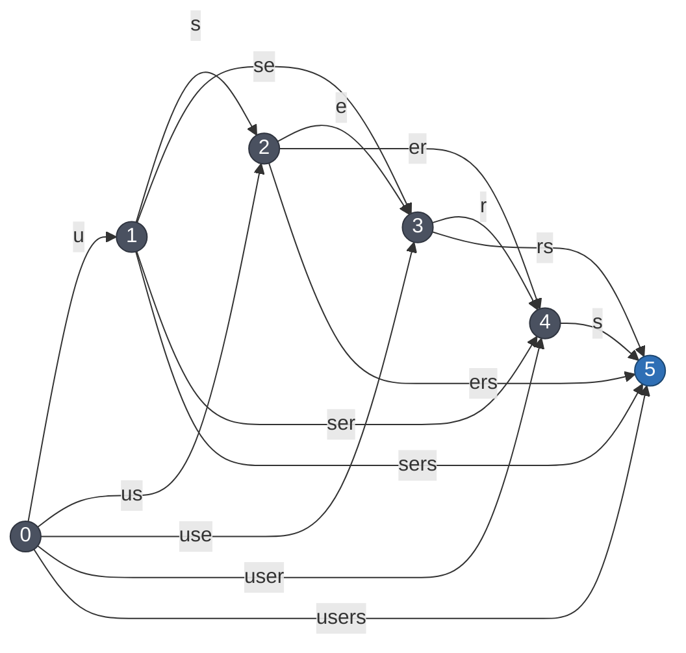
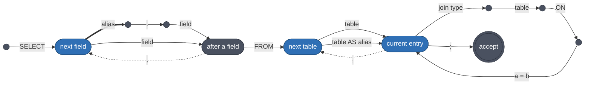

# oraculum



## Architecture

Two things have to be true of every statement the system produces. It has to be **grammatical** - a well formed `SELECT`. And it has to be **meaningful** - a query the schema can actually answer. Both are enforced one token at a time, while the model is writing, so neither is ever checked after the fact.

### 1. Tokens - characters, words, pieces of text

A grammar talks about text: the word `SELECT`, a comma, an identifier. A language model emits **tokens** drawn from a fixed vocabulary, and the same text can arrive many ways.



To compare the two you have to turn a token sequence back into text, which just means gluing the pieces together. Call that $c$:

```math
c(v_1 v_2 \cdots v_k) \;=\; v_1 v_2 \cdots v_k
```

Gluing carries concatenation of tokens to concatenation of text, $c(xy) = c(x)\,c(y)$, which is the only sense in which the vocabulary is a homomorphism.

So what has to be enforced is the set of token sequences that glue into the set $L$ of legal texts:

```math
c^{-1}(L) \;=\; \{\, w \in V^{*} \;:\; c(w) \in L \,\}
```

That is every way of spelling something in $L$ with this vocabulary. For $L = \{\texttt{"users"}\}$ that is the handful of chops above; for an infinite $L$ it is infinite.

$c$ is many-to-one wherever it is defined at all, so for any $L$ this vocabulary can spell, $c^{-1}(L)$ is larger than $L$ and can never be listed; it has to be a machine. And regular languages survive inverse homomorphism, so whenever $L$ is regular that machine is a finite automaton over $V$. It is what `kernel` calls an **index** and sections 2 to 4 are three ways of building one.

```
NOTE: What an index is from outside

You hand the factory a description - a constant, a pattern, or a
difference of other indexes - and get back an id. After that the only
thing anyone says is "advance index 7 by token 1204" and which of the
three kinds it happens to be stops mattering.

The one place it does matter is that a group is built over other indexes
rather than over flat ones, so an exclusion can itself be a difference
and subtractions nest. And none of the three stores a position, which is
why one automaton can sit behind every active index using it.
```

### 2. Constants: a graph over the gaps in a string

Take the constant `users`. Put a node at every position in it - before the `u`, between each pair of letters, after the `s`. Six nodes for five characters, because `users` is ASCII: positions are byte offsets, so a multi-byte character spans several nodes rather than one. Then draw an edge from $i$ to $j$ whenever some vocabulary token spells exactly the characters between them.

A **path from 0 to 5 is one way of spelling `users`** and every way appears as a path. So this graph *is* $c^{-1}(\{\texttt{users}\})$, drawn out. It is acyclic because every edge moves right and it has one accepting node, the last one.

The encoding follows from the picture. Group the edges by their source node and two facts let most of the data disappear:

- the label already determines the target, since $j = i + |v|$ with $|v|$ the token's length in bytes, so no target needs storing;
- node $i$ is accepting exactly when $i$ is the last node, so the position *is* the accepting flag and none needs storing either.

The second one turns on reaching the end of the constant, which is a stronger condition than having no outgoing edges: a byte offset in the middle of a multi-byte character has none either, and it must not accept.

What is left is the out-edge labels, grouped by source - two arrays. Finding the edges in the first place is one **Aho-Corasick** pass: a single automaton holding all 255,386 tokens as patterns, built once per vocabulary, which reports every token occurring anywhere in `users` in one sweep.

```
NOTE: What a lattice answers

Ask it which tokens leave position i and it hands back a slice of an
array it already holds - no allocation, no search. That is the only
question it needs to answer: the target is i plus the token's length in
bytes, and reaching the end of the constant is what accepting means, so
neither is stored.

The Aho-Corasick automaton that found the edges is not part of it. It is
built once per vocabulary, read while the arrays are filled and shared by
every lattice afterwards.
```

### 3. Regular expressions: a state is the regex that is left

A constant has a graph you can draw. A regular expression's automaton has to be discovered instead, and the trick is to let **the states be regular expressions themselves**.

The *derivative* of a regex $r$ by a character $b$, written $\partial_b r$, is exactly what remains of the regex after stripping off just the **first, single character** $b$:

```math
\partial_b r \;=\; \{\, w \;:\; bw \in L(r) \,\}
```

Counted up to similarity - treating union as associative, commutative and idempotent - a regular expression has only finitely many distinct derivatives. So the derivatives close into the state set of a finite automaton.

Take the SQL identifier pattern `[a-zA-Z_][a-zA-Z0-9_]*`. Reading a `u` consumes the first character class and leaves the starred tail. Reading another letter from the starred tail leaves the exact same starred tail again:

```
  r          = [a-zA-Z_][a-zA-Z0-9_]*
  d_u(r)     = [a-zA-Z0-9_]*
  d_s(d_u(r))= [a-zA-Z0-9_]* -> The same regex, no new state
```

Two live derivatives means exactly **two states** - which is what the built automaton reports. There is a third, $\emptyset$, reached by starting with a digit; it is the dead state and nothing stores it. Brzozowski's theorem guarantees the search terminates: up to similarity the derivatives are finite in number, so the states run out. `derivre` computes them lazily, materialising a state the first time it is reached.

That gives an automaton over *characters*. One more step turns it into one over tokens: to take a token $v$, walk all of its characters at once.

```math
\delta(q, v) \;=\; \partial_{v}\,q \quad\text{- read every character of } v \text{ in turn}
```

Done naively that is 255,386 walks per state. Instead the vocabulary is held as a **trie** and the walk descends it once: the moment a character kills the branch, every token below that prefix is dead too and the whole subtree is skipped.

The automata that come out are tiny in states and enormous in edges:

```
[a-zA-Z_][a-zA-Z0-9_]*     2 states      53,097 and 53,118 edges      849,816 bytes
[ \n\t]+                   2 states                                     1,628 bytes
```

**An index costs its edge count.**

### 4. Difference without a product

An alias is any identifier that is not something else - not a keyword, not a table name, not a field name. That is a set difference:

```math
L(G) \;=\; L(\mathrm{inc}) \;\setminus\; \bigl( L(\mathrm{exc}_1) \cup \cdots \cup L(\mathrm{exc}_k) \bigr)
```

Regular languages are closed under difference, so an automaton for this exists: the product of the inclusion with the complement of each exclusion. Its states are bounded by the product of theirs:

```math
|Q_G| \;\le\; |Q_{\mathrm{inc}}| \times |Q_{\mathrm{exc}_1}| \times \cdots \times |Q_{\mathrm{exc}_k}|
```

On a three-table schema $k$ is 85 and it grows with the schema, so that product is never built. Instead the members stay separate automata, all of them are fed the same token and the difference is taken **when the word is asked whether it may end** rather than in the state space:

```math
\begin{aligned}
\delta_G(q, v) &= \delta_{\mathrm{inc}}(q, v) && \text{the inclusion alone decides which token may come next} \\
F_G &= F_{\mathrm{inc}} \setminus \bigl( F_1 \cup \cdots \cup F_k \bigr) && \text{every member decides whether the word may end}
\end{aligned}
```

The asymmetry is what the situation calls for. An exclusion must never restrict the *next* token, because a longer word escapes it - `users` is excluded but `users2` is fine. An exclusion only ever removes the right to **stop**. So a group whose inclusion accepts while some exclusion also accepts is *blocked*: it withholds the terminating token and stays unfinished, forcing generation onward.

```
u        include accepts, no exclusion does            -> accepted
users    include accepts, the `users` exclusion does   -> blocked
users2   the `users` exclusion died on the `2`         -> accepted
```

One fact keeps this cheap. Every member is anchored at the start of the word, so an exclusion that rejects a token can never match again. Exclusion liveness only ever decreases, dead members are dropped and against a real vocabulary nearly all 85 die on the first token.

The trade is explicit. The member automata cost $O\bigl(\sum_i |Q_i|\bigr)$ once and every head shares them; an active alias adds only $O(k)$ on top of that - one node id per member still standing, which the dropping drives towards $O(1)$. The alternative is $O\bigl(\prod_i |Q_i|\bigr)$ of automaton, per schema, up front.

### 5. The graph: lazy determinization of an automaton nobody can build

Above the indexes sits the syntax graph. It weaves the raw primitives (constants, regexes, and groups) together into the overarching SQL grammar.

The grammatical skeleton is right-linear:



Solid edges are lattices, dashed ones expressions and the thick one is the alias group. The whitespace between tokens is an expression index of its own and is left out of the picture, as are the `AS alias` a join target may carry.

If it were just this static structure, the language could be compiled ahead of time into one massive DFA. 

But it isn't static. The three heavy states are the ones whose alternatives come from the latent context rather than from the grammar. Whether `head` may take the `;` or has to open another table entry depends on what has *already been selected*, and the `field` edge out of `ref` ranges over the fields that are *still selectable in the current latent state*. 

Every node evaluates a Boolean function over the latent context (the constraints on tables, aliases, and selected fields). 

Because of this, the determinized machine is built lazily while it is walked. A **configuration** is a finite set of heads:

```math
\begin{aligned}
\mathcal{C} &= \bigl\{\, (M_i,\; \mathit{ctx}_i,\; k_i) \,\bigr\} && \text{memory, state, continuation} \\
\mathrm{routes}(\mathcal{C}) &= \bigcup_i \mathrm{transitions}(M_i) \\
\mathrm{feed}(\mathcal{C}, v) &= \mathrm{expand}\Bigl( \bigl\{\, (M_i',\; \mathit{ctx}_i,\; k_i) \;:\; M_i' = M_i \text{ after } v, \text{ alive} \,\bigr\} \Bigr)
\end{aligned}
```

$\mathrm{routes}$ evaluates the transition function over the live frontier - effectively performing the subset construction one token at a time instead of tabulating it in advance. $\mathrm{expand}$ resolves the fixpoint: whenever a head reaches the end of its index, it yields its continuation $k_i$, applying it to the updated state $\mathit{ctx}_i$, spawning the next set of required indexes until nothing new appears.

For a fixed schema the reachable configurations are technically finite, so the DFA does theoretically exist. But with $n$ tables carrying $2^{2^n}$ boolean functions, plus alias resolutions and join graphs, it is strictly unbuildable, so the determinization stays lazy.

```
NOTE: The layers that meet at a head

A head is one active index and three layers stack at it. Underneath is
the automaton: immutable, positionless, shared by every head walking it.
Over that sits a single walk, private to this head, shaped like the
automaton - a node id for a flat index, or one sub-walk per member for a
group. Over that sits a payload the kernel stores and never opens.

From outside, the loop is: spawn a head with an index and a payload, feed
tokens and when the head reaches the end of its automaton you are handed
your payload back together with the text it matched. Looking up which
grammar rule that was, narrowing the state, producing the next indexes -
all of that happens on the Python side and is invisible here.

The payload is what makes a branch a branch. It carries the state this
branch has committed to and a rule never mutates it; it returns a copy,
so no sibling can observe the choice.
```

### 6. The latent state: semantics as algebra

The state each rule is run against is a `Context`. It carries everything the statement has committed to so far and it answers three kinds of question out of three structures. Every operation that changes it works on a copy, so branches never see each other.

#### 6a. Unqualified fields: exactly one, as a polynomial

Write $t_1, \ldots, t_n$ for the tables, each a variable that is $1$ when the table is in the FROM clause. Selecting an unqualified field constrains those variables and the constraint is a Boolean function.

The natural home for Boolean functions here is $\mathbb{F}_2$, the field with two elements, where **addition is XOR and multiplication is AND**. `Root` works in the ring of such functions:

```math
R \;=\; \mathbb{F}_2[t_1, \ldots, t_n] \,\big/\, (t_i^2 - t_i)
```

The quotient says $t^2 = t$: a table is either in the query or not and saying it twice adds nothing.

A field $f$ that lives in the tables $T(f)$ says *exactly one of those is where it came from*. Writing that as a polynomial is easy for one or two tables and gets interesting after:

```math
\begin{aligned}
|T(f)| = 1 : \quad C(f) &= a \\
|T(f)| = 2 : \quad C(f) &= a + b && \text{plain XOR} \\
|T(f)| = 3 : \quad C(f) &= a + b + c \;+\; abc \\
|T(f)| = 4 : \quad C(f) &= a + b + c + d \;+\; abc + abd + acd + bcd
\end{aligned}
```

For two tables, "exactly one" *is* XOR. For three it is not: $a + b + c$ over $\mathbb{F}_2$ is the **parity** function - it is $1$ when an odd number of tables are on. That is right for one table and wrong for three. The $abc$ term is there to cancel the all-three case and nothing else, since it is $0$ everywhere else.

The pattern that falls out is clean. $C(f)$ is the sum of **every odd-sized subset** of $T(f)$:

```math
C(f) \;=\; \sum_{\substack{S \subseteq T(f) \\ |S| \text{ odd}}} \;\; \prod_{i \in S} t_i
```

and it is exactly-one for a one-line reason: if $m$ tables are on, the terms that survive are the odd-sized subsets of those $m$, and for $m \ge 1$ there are $2^{m-1}$ of them - even for every $m \ge 2$, so they cancel. The sum is $1$ only when $m = 1$, and empty, hence $0$, when $m = 0$.

Selecting a field multiplies its constraint into a running product, which is AND:

```math
P \;\leftarrow\; P \cdot C(f), \qquad P \text{ starts at } 1
```

$P$ is the latent state: the function that is $1$ on exactly those FROM clauses still consistent with everything selected. Every question is now an evaluation of it:

```math
\begin{aligned}
P = 0 \quad&\Longleftrightarrow\quad \text{the selection is contradictory} \\
P|_{t = 1} = 0 \quad&\Longleftrightarrow\quad \text{table } t \text{ contradicts the selection} \\
P|_{t_1 = \cdots = t_n = 0} = 1 \quad&\Longleftrightarrow\quad \text{nothing is outstanding: the query is satisfied} \\
P \cdot C(f) = 0 \quad&\Longleftrightarrow\quad \text{field } f \text{ is excluded} \\
\bigl\{\, t \in \mathrm{vars}(P) \;:\; P|_{t = 1} \neq 0 \,\bigr\} \quad&=\quad \text{the tables still able to satisfy it}
\end{aligned}
```

Two of those lines need care. The last one ranges over the variables $P$ still mentions rather than over every table: a table $P$ has stopped depending on is *compatible* with the selection but not *required* by it, and only what $P$ still depends on belongs in the FROM clause. Selecting `email` leaves $P = u$, and it is `users` alone that is outstanding - `posts` and `comments` pass the $P|_{t=1} \neq 0$ test but appear nowhere in $P$. The second line has the mirror image of the same subtlety: a table already named has been substituted away and no longer appears in $P$, so the test can never flag it again, and the excluded set carries the used tables alongside.

Idempotence earns its keep. Selecting `body` and then `user_id`, both living in exactly `{comments, posts}`, leaves $P = c + p$ unchanged, because $(c+p)^2 = c+p$ - the second field adds no information and the algebra says so with no special case. Naming a table is substitution: setting $u = 1$ discharges the demand of every constraint mentioning it. What is left is rarely the constant $1$ - selecting `body` and then naming `posts` leaves $P = c + 1$, which goes on forbidding `comments` - but its value at the origin is $1$, and that evaluation is what satisfaction tests.

```
NOTE: Why copying a Context is cheap

It is copied at every choice, so it has to be. The ring, the variable map
and the per-field constraint polynomials are built once per schema and
never change, so a copy just rebinds them; the running product and the
field sets are values, so they need no copying at all.

The join graph is the exception, since contraction mutates it - it is
genuinely duplicated per branch and only after the FROM keyword has
built it. Underneath the running product sits PolyBoRi's decision
diagram, which is where the 0.25 us multiply comes from.
```

#### 6b. Aliased fields: intersection

An alias denotes **exactly one** table and cannot be two things at once, which removes all the cross-talk the ring was needed for. `Scope` is then a plain intersection:

```math
\mathit{cand} \;\leftarrow\; \mathit{cand} \,\cap\, T(f)
```

A selection that would empty $\mathit{cand}$ is refused outright and leaves it untouched, so $\emptyset$ never means contradiction: it is what naming the table produces, and it is exactly the condition for the scope being satisfied. `Scopes` is the registry of them, reporting an aliased table as the qualified node `"users u"` so that `users` and `users u` stay distinguishable downstream. `Conflicts` is the facade over both halves.

#### 6c. The FROM clause: graph contraction

Once the fields are chosen, the required tables have to be **connected**. `Relationships` builds a multigraph whose vertices are the tables - plus aliased nodes like `"users u"` - and whose edges are the foreign keys, each labelled with the column pair it joins on.

One FROM entry is a connected piece being grown from a head vertex $h$. Joining a neighbour $x$ is **vertex contraction**:

```math
\mathrm{join}(h, x) : \qquad G \;\leftarrow\; G \,/\, \{h, x\}
```

Contraction is the right operation because it reproduces SQL's own rule: after a join the pair behaves as one relation, every column of either is reachable and the merged vertex inherits both neighbourhoods - so a table two foreign keys away only becomes joinable once the table between them has been joined in.

The `ON` columns are the label on the edge, so choosing the target determines them.

```
NOTE: What the join graph answers

Ask it what can be joined onto the current entry and you get back, per
edge, the neighbouring table together with the two columns the ON clause
needs. Those are read off the edge label. The label is stored undirected
and oriented when asked, so the head's column always comes out first.

It is a multigraph deliberately: two tables joined by two different
foreign keys are two alternatives, and both stay. The head is a single
vertex name, so growing one FROM entry is a sequence of contractions
into it.
```

## Experiments

Regular expression used: `(monday|tuesday|wednesday|thursday|friday)+`!
With the following token selection: `we -> d -> ne -> s -> day`!
Gemma 3 vocabulary is used!

### 1st - Ahead-of-time lattice building for constants using the Aho-Corasick algorithm

Token lattice approach for breaking up text into a Directed Acyclic Graph (forming all possible routes to build the text using the given vocabulary). The initial (one-time) build time (against the vocabulary) takes 2.3 s with extremely fast lattice construction (e.g. 80 µs for `It has snowed a lot in Europe`) and between 3-10 µs to traverse in the DAG. **No regular expression support**, but good for constant values!

### 2nd - Just-in-time lattice generation using only `guidance-ai/derivre`

Pure regex-based matching with derivative automata. 257 µs build time for the example regular expression. Slow next token filtering because of the exhaustive token matching, around 39 ms per step.

### 3rd - Just-in-time lattice generation using `microsoft/toktrie` and `guidance-ai/derivre`

Hybrid approach combining derivre and toktrie. 403 ms trie building (one time for a given vocabulary), 330 µs build time for the example regular expression. Moderate efficiency through trie pruning, 200-500 µs per step. Its weakness is the still relatively high transition attempts compared to AOT-based methods.

### 4th - Ahead-of-time lattice building for regular expressions using `dottxt-ai/outlines-core`

Prebuilt-based regex matching with precomputed token patterns. The obvious weakness are the increased memory usage for storing the index and the higher upfront cost: 211.950862 ms vocabulary rebuild (one time) and 1.190878411 s index build for the example regular expression. Its strength is its exceptional runtime efficiency, 6-18 µs per step.

### 5th - Ahead-of-time lattice building for regular expressions using `regex-automata` directly

Same as `outlines-core`. The `Index::new` function of Outlines is using linear search to build a token DFA on top of the regular expression byte DFA of `regex-automata`. This strategy is slow, could be improved - and it makes no sense to depend on a library which wraps another library in a couple of hundreds of lines. 583.171892 ms index build time for the example regular expression, 6-18 µs per step. The unanswered question, why build time decreased so much when using the same regular expression engine behind the scenes - perhaps it is due to no memory copy has to be initiated, the same vocabulary data structure is used as it is.

### 6th - Ahead-of-time lattice building for regular expressions using `microsoft/toktrie` and `guidance-ai/derivre`

The combination of AOT index building with TokTrie - Derivre: faster build time, same number of token matching per step as Outlines. 399.975656 ms trie building time (needed only once for a given vocabulary), 4.334894 ms index building time for the example regular expression and 7-21 µs per step.

### 7th - Performance comparisons between `FastHashDFA` vs. `DoubleHashDFA` vs. `FlatDFA`

The benchmarks demonstrate a space-time trade-off where the flat structures achieves the fastest performance for scanning and hash structures for lookups; while hybrid solutions are the fastest, they require the largest memory allocation. Ultimately, the `DoubleHashDFA` (the implementation `outlines-core` uses) proves to be a good universal solution, average in both lookups and scans, but only suffering (worst case) 2x memory usage compared to `FlatDFA` which is the most compact, but having a slow lookup algorithm due to its linearity (optimized by binary tree search on a CSR data structure, but still lacking the jump capabilities of hash functions). The heavily optimized `FastHashDFA` tries to combine both of the two worlds and outperforms other candidates in lookup and scan speeds, but suffers a high memory usage.

### 8th - Namespace resolution

Selecting fields from tables and dynamically restricting field space as the selection goes by, then enforcing tables that satisfy the previous field selections. Supporting both a global namespace and many individual "alias" namespaces. Using boolean algebra under the hood.

Written in Rust with the `boolean_expression` crate. Two resolver types sit behind a unified `Context`:

- **`ManyResolver`** (global namespace) - builds a BDD over table variables. For each field it constructs the *exactly-one* constraint: the BDD function that is true when exactly one of the field's tables is on. Selecting a field ANDs its constraint into a running product; a field is offered only when its constraint ANDed with the current product is still satisfiable. Table resolution uses `restrict` (substituting a variable to `true`) and satisfaction checks evaluate the BDD with all variables `false`.

- **`OneResolver`** (per-alias namespace) - uses plain set intersection instead of BDD algebra. An alias denotes a single table, so each field selection intersects the candidates with the field's table set. No cross-talk between aliases, no polynomial machinery needed.

`Context` keeps one `ManyResolver` for unqualified fields and an `FxHashMap` of `OneResolver`s keyed by alias name. Setting a namespace before selecting a field routes the selection to the right resolver. Required tables are the union of both halves and the query is satisfied when both the global BDD and every alias scope have been fully discharged. The whole `Context` is `Clone`, so branching is a value copy.

### 9th - Advanced modelling

Reimplements and extends Context in Python using SageMath, adding schema parsing, a proper GF(2) polynomial ring and foreign-key graph traversal. This is the modelling `seer` adopts.

**Field selection & boolean conflict resolution:** `Root` replaces the BDD of Experiment 8 with a `BooleanPolynomialRing` over GF(2). For each field the *exactly-one* constraint is built as the sum of terms $t_i \cdot \prod_{j \neq i}(1 + t_j)$, which over GF(2) is `1` when exactly one table is on. Selecting a field multiplies its constraint into a running product $P$; table viability is tested by substituting $t = 1$; and satisfaction checks evaluate $P$ with all variables set to `0`. `Scope` handles aliased fields with set intersection (as `OneResolver` did), `Scopes` is the registry and `Conflicts` is the façade that unifies both, propagating alias table resolutions back into `Root` when an aliased table also appears in the global polynomial.

**FROM/JOIN via graph contraction:** `Relationships` builds a SageMath `Graph` whose nodes are the required tables (including aliased variants like `"c x"`) and whose edges are foreign-key references, each labelled with the `(src_table.column, dst_table.column)` pair. Growing a FROM entry is a sequence of vertex contractions (`merge_vertices`): joining a neighbour merges it into the head, unifying both neighbourhoods so that tables two hops away become directly reachable. The `ON` columns are read from the edge label, never guessed. Excluded tables (those the conflict resolver has ruled out) are hidden from the joinable set.

## License

This project is licensed under the [GNU Affero General Public License v3.0](LICENSE).

The AGPL-3.0 is a strong copyleft license that requires you to release the source code of any modified versions of this software, including when used over a network.
