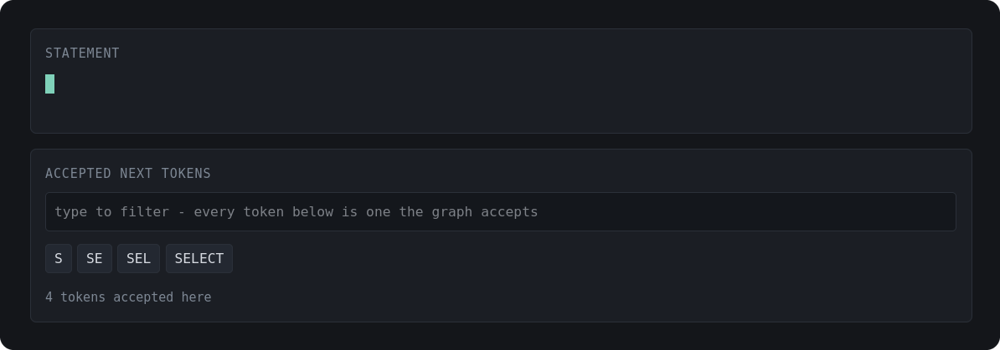
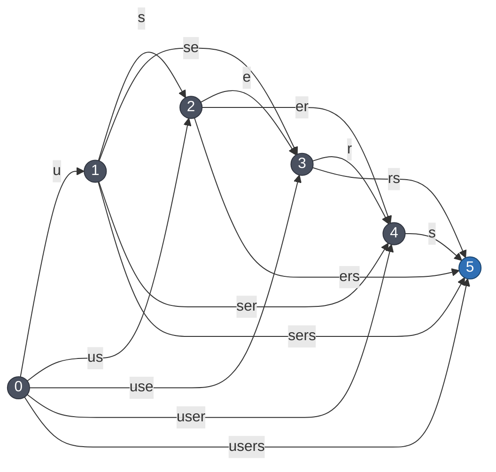
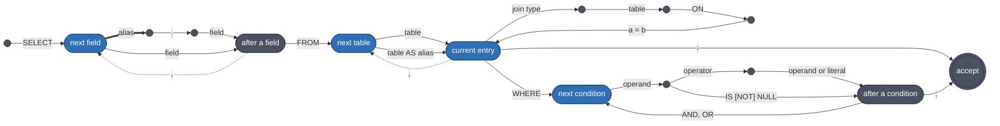

# oraculum

Text to SQL conversion for the following subset of the SQL language.

```xml
<statement> := SELECT <fields> FROM <entry> [, <entry>]* [WHERE <filters>] ;

<fields>    := <field ref> [, <field ref>]*
<field ref> := <field> | <alias>.<field>

<entry>     := <source> [<join>]*
<join>      := <join type> <source> ON <column ref> = <column ref>
<source>    := <table> [AS <alias>]
<join type> := INNER JOIN | LEFT JOIN | RIGHT JOIN | FULL JOIN

<filters>   := <predicate> [(AND | OR) <predicate>]*
<predicate> := [NOT] (<condition> | "(" <filters> ")")
<condition> := <operand> <operator> <operand | literal>
             | <operand> IS [NOT] NULL
<operand>   := <column> | <qualifier>.<column>
```

## Running it in the browser

<p align="center">
  <a href="https://pinting.github.io/oraculum/">
    
  </a>
</p>

## Building & running locally

Needs [Rust](https://rustup.rs), [UV](https://docs.astral.sh/uv/getting-started/installation)
and Python 3.14. Everything else is downloaded at a version this repository
names.

Each project builds itself, from its own directory:

```bash
cd seer
make build       # seer and the kernel, natively
make test        # the corpus, one character at a time
make run         # interactive: the graph offers tokens, you pick one
make live        # the same, with a model doing the picking
make wasm        # the same kernel, cross compiled to WebAssembly
```

```bash
cd kernel
make build       # the kernel alone, into its own venv
make benchmark   # DFA layouts, timed
```

```bash
make docs        # the browser build, into docs/
```

## Introduction

Let's have the following example walkthrough over the attached SQL schema!

```sql
CREATE TABLE users (
    id BIGINT PRIMARY KEY,
    first_name VARCHAR(255) NOT NULL,
    last_name VARCHAR(255) NOT NULL,
    email VARCHAR(255) UNIQUE NOT NULL,
    verified BOOLEAN,
    created_at TIMESTAMP
);

CREATE TABLE posts (
    id BIGINT PRIMARY KEY,
    user_id BIGINT NOT NULL REFERENCES users(id),
    title VARCHAR(255) NOT NULL,
    body TEXT NOT NULL,
    published_at TIMESTAMP
);

CREATE TABLE comments (
    id BIGINT PRIMARY KEY,
    user_id BIGINT NOT NULL REFERENCES users(id),
    post_id BIGINT NOT NULL REFERENCES posts(id),
    body TEXT NOT NULL
);
```

**The projection.** One or more columns, each written bare or qualified by an
alias. An alias is invented by whoever is generating, since nothing in the
schema names it, so it may be any identifier that is not a keyword, a table
name or a column name - `users2` is available, `users` is not. Aliases are
introduced here and nowhere else: `FROM users AS u` is reachable only once
something has written `u.` in the projection.

```sql
SELECT email, first_name FROM users;
SELECT u.email, u.first_name FROM users AS u;
```

What may be written is what the schema can still answer. `email` is on `users`
alone, so writing it settles the FROM clause; `body` is on `posts` and
`comments`, so it leaves both open until something else decides between them,
and `first_name` stops being offered the moment the query has committed to a
table that has no such column. Section 6a is how that is computed.

**The FROM clause.** One or more entries, comma separated, each a table
optionally renamed by `AS`. Only tables the projection actually requires are
ever offered, and the statement cannot reach its terminator until every one of
them has been supplied.

```sql
SELECT email, body FROM users, comments;
```

**Joins.** Any entry may be grown by any number of joins, in all four types.
The target has to be a foreign key neighbour of the entry as it now stands, and
that settles the `ON` columns outright - they are read off the foreign key
rather than chosen.

```sql
SELECT email, title FROM users INNER JOIN posts ON users.id = posts.user_id;
SELECT email, title FROM users FULL JOIN posts ON users.id = posts.user_id;
SELECT title, c.body FROM posts LEFT JOIN comments AS c ON posts.id = c.post_id;
```

Joining merges the two, so a table two foreign keys away becomes reachable once
the table between them is in. The second join here is only offered because the
first one brought `posts` into the entry:

```sql
SELECT email, title, c.body
FROM users
INNER JOIN posts ON users.id = posts.user_id
INNER JOIN comments AS c ON posts.id = c.post_id;
```

A renamed source answers to its alias everywhere afterwards and to nothing
else, so `FROM users AS u` makes the join `ON u.id = posts.user_id`, never
`ON users.id`. Section 6c is the graph this walks.

**The WHERE clause.** Optional, and written against the relation the FROM
clause produced: every column of every source it placed, joined or not.
Each is reachable qualified by its source's alias or table name, and bare
wherever exactly one source supplies the name. A column does not have to be
projected to be filtered on.

```sql
SELECT email FROM users WHERE created_at IS NOT NULL;
SELECT email FROM users WHERE first_name LIKE 'A%';

SELECT email, title
FROM users
INNER JOIN posts ON users.id = posts.user_id
WHERE created_at < published_at;
```

Which operators a column takes is fixed by its type. Everything may be compared
for equality, only the classes that have an order may be ranged over, only text
may be matched against a pattern, and only a column that can actually be null
may be tested for it - which a `PRIMARY KEY` cannot, however it was declared.

| type | operators | literal | example |
|---|---|---|---|
| `BIGINT`, `INT`, `DECIMAL`, ... | `=` `!=` `<` `<=` `>` `>=` | `-?[0-9]+(\.[0-9]+)?` | `users.id >= -1` |
| `VARCHAR`, `TEXT`, `CHAR`, ... | `=` `!=` `<` `<=` `>` `>=` `LIKE` `NOT LIKE` | `'...'` | `email LIKE '%keyword%'` |
| `TIMESTAMP`, `DATE`, `TIME`, ... | `=` `!=` `<` `<=` `>` `>=` | `'2024-01-31 12:30:00'` | `created_at > '2024-01-31'` |
| `BOOLEAN`, `BIT` | `=` `!=` | `TRUE`, `FALSE` | `verified != FALSE` |
| `BLOB`, `BYTEA`, unrecognised | `=` `!=` | none - columns only | |
| any of them, where nullable | `IS NULL`, `IS NOT NULL` | | `published_at IS NULL` |

The other side of an operator is either a literal of that shape or another
column of the same class, which is what makes `created_at < published_at` a
statement about two timestamps and `email = users.id` no statement at all.
Sections 6d and 6e are the relation and this gating.

Conditions combine with `AND` and `OR`, take a `NOT` in front, and nest three
brackets deep:

```sql
SELECT email FROM users WHERE email = 'a' AND users.id > 1;
SELECT email FROM users WHERE NOT email LIKE 'a%';
SELECT email FROM users WHERE (email = 'a' OR email = 'b') AND NOT users.id = 1;
```

**Outside the subset.** `*` and `DISTINCT`, output aliases (`SELECT email AS e`),
aggregates and every other function call, arithmetic, `IN`, `BETWEEN`, `CASE`,
`GROUP BY`, `HAVING`, `ORDER BY`, `LIMIT`, `OFFSET`, subqueries, set operations,
and any statement that is not a `SELECT`. Whitespace between tokens is free -
spaces, tabs and newlines, one or more - and the statement ends at its
semicolon.

Two things have to be true of every statement the system produces. It has to be **grammatical** - a well formed `SELECT`. And it has to be **meaningful** - a query the schema can actually answer. Both are enforced one token at a time, while the model is writing, so neither is ever checked after the fact.

## Architecture

### 1. Tokens - characters, words, pieces of text

A grammar talks about text: the word `SELECT`, a comma, an identifier. A language model emits **tokens** drawn from a fixed vocabulary, and the same text can arrive many ways.



To compare the two you have to turn a token sequence back into text, which just means gluing the pieces together. Call that $c$:

```math
c(v_1 v_2 \cdots v_k) \;=\; v_1 v_2 \cdots v_k
```

Gluing carries concatenation of tokens to concatenation of text, $c(xy) = c(x)\,c(y)$, which is the only sense in which the vocabulary is a homomorphism.

So what has to be enforced is the set of token sequences that glue into the set $L$ of legal texts:

```math
c^{-1}(L) \;=\; \{\, w \in V^{*} \;:\; c(w) \in L \,\}
```

That is every way of spelling something in $L$ with this vocabulary. For $L = \{\texttt{"users"}\}$ that is the handful of chops above; for an infinite $L$ it is infinite.

$c$ is many-to-one wherever it is defined at all, so for any $L$ this vocabulary can spell, $c^{-1}(L)$ is larger than $L$ and can never be listed; it has to be a machine. And regular languages survive inverse homomorphism, so whenever $L$ is regular that machine is a finite automaton over $V$. It is what `kernel` calls an **index** and sections 2 to 4 are three ways of building one.

```
NOTE: What an index is from outside

You hand the factory a description - a constant, a pattern, or a
difference of other indexes - and get back an id. After that the only
thing anyone says is "advance index 7 by token 1204" and which of the
three kinds it happens to be stops mattering.

The one place it does matter is that a group is built over other indexes
rather than over flat ones, so an exclusion can itself be a difference
and subtractions nest. And none of the three stores a position, which is
why one automaton can sit behind every active index using it.
```

### 2. Constants: a graph over the gaps in a string

Take the constant `users`. Put a node at every position in it - before the `u`, between each pair of letters, after the `s`. Six nodes for five characters, because `users` is ASCII: positions are byte offsets, so a multi-byte character spans several nodes rather than one. Then draw an edge from $i$ to $j$ whenever some vocabulary token spells exactly the characters between them.

A **path from 0 to 5 is one way of spelling `users`** and every way appears as a path. So this graph *is* $c^{-1}(\{\texttt{users}\})$, drawn out. It is acyclic because every edge moves right and it has one accepting node, the last one.

The encoding follows from the picture. Group the edges by their source node and two facts let most of the data disappear:

- the label already determines the target, since $j = i + |v|$ with $|v|$ the token's length in bytes, so no target needs storing;
- node $i$ is accepting exactly when $i$ is the last node, so the position *is* the accepting flag and none needs storing either.

The second one turns on reaching the end of the constant, which is a stronger condition than having no outgoing edges: a byte offset in the middle of a multi-byte character has none either, and it must not accept.

What is left is the out-edge labels, grouped by source - two arrays. Finding the edges in the first place is one **Aho-Corasick** pass: a single automaton holding all 255,386 tokens as patterns, built once per vocabulary, which reports every token occurring anywhere in `users` in one sweep.

```
NOTE: What a lattice answers

Ask it which tokens leave position i and it hands back a slice of an
array it already holds - no allocation, no search. That is the only
question it needs to answer: the target is i plus the token's length in
bytes, and reaching the end of the constant is what accepting means, so
neither is stored.

The Aho-Corasick automaton that found the edges is not part of it. It is
built once per vocabulary, read while the arrays are filled and shared by
every lattice afterwards.
```

### 3. Regular expressions: a state is the regex that is left

A constant has a graph you can draw. A regular expression's automaton has to be discovered instead, and the trick is to let **the states be regular expressions themselves**.

The *derivative* of a regex $r$ by a character $b$, written $\partial_b r$, is exactly what remains of the regex after stripping off just the **first, single character** $b$:

```math
\partial_b r \;=\; \{\, w \;:\; bw \in L(r) \,\}
```

Counted up to similarity - treating union as associative, commutative and idempotent - a regular expression has only finitely many distinct derivatives. So the derivatives close into the state set of a finite automaton.

Take the SQL identifier pattern `[a-zA-Z_][a-zA-Z0-9_]*`. Reading a `u` consumes the first character class and leaves the starred tail. Reading another letter from the starred tail leaves the exact same starred tail again:

```
  r          = [a-zA-Z_][a-zA-Z0-9_]*
  d_u(r)     = [a-zA-Z0-9_]*
  d_s(d_u(r))= [a-zA-Z0-9_]* -> The same regex, no new state
```

Two live derivatives means exactly **two states** - which is what the built automaton reports. There is a third, $\emptyset$, reached by starting with a digit; it is the dead state and nothing stores it. Brzozowski's theorem guarantees the search terminates: up to similarity the derivatives are finite in number, so the states run out. `derivre` computes them lazily, materialising a state the first time it is reached.

That gives an automaton over *characters*. One more step turns it into one over tokens: to take a token $v$, walk all of its characters at once.

```math
\delta(q, v) \;=\; \partial_{v}\,q \quad\text{- read every character of } v \text{ in turn}
```

Done naively that is 255,386 walks per state. Instead the vocabulary is held as a **trie** and the walk descends it once: the moment a character kills the branch, every token below that prefix is dead too and the whole subtree is skipped.

The automata that come out are tiny in states and enormous in edges:

```
[a-zA-Z_][a-zA-Z0-9_]*     2 states      53,097 and 53,118 edges      849,816 bytes
[ \n\t]+                   2 states                                     1,628 bytes
```

**An index costs its edge count.**

### 4. Difference without a product

An alias is any identifier that is not something else - not a keyword, not a table name, not a field name. That is a set difference:

```math
L(G) \;=\; L(\mathrm{inc}) \;\setminus\; \bigl( L(\mathrm{exc}_1) \cup \cdots \cup L(\mathrm{exc}_k) \bigr)
```

Regular languages are closed under difference, so an automaton for this exists: the product of the inclusion with the complement of each exclusion. Its states are bounded by the product of theirs:

```math
|Q_G| \;\le\; |Q_{\mathrm{inc}}| \times |Q_{\mathrm{exc}_1}| \times \cdots \times |Q_{\mathrm{exc}_k}|
```

On a three-table schema $k$ is 85 and it grows with the schema, so that product is never built. Instead the members stay separate automata, all of them are fed the same token and the difference is taken **when the word is asked whether it may end** rather than in the state space:

```math
\begin{aligned}
\delta_G(q, v) &= \delta_{\mathrm{inc}}(q, v) && \text{the inclusion alone decides which token may come next} \\
F_G &= F_{\mathrm{inc}} \setminus \bigl( F_1 \cup \cdots \cup F_k \bigr) && \text{every member decides whether the word may end}
\end{aligned}
```

The asymmetry is what the situation calls for. An exclusion must never restrict the *next* token, because a longer word escapes it - `users` is excluded but `users2` is fine. An exclusion only ever removes the right to **stop**. So a group whose inclusion accepts while some exclusion also accepts is *blocked*: it withholds the terminating token and stays unfinished, forcing generation onward.

```
u        include accepts, no exclusion does            -> accepted
users    include accepts, the `users` exclusion does   -> blocked
users2   the `users` exclusion died on the `2`         -> accepted
```

One fact keeps this cheap. Every member is anchored at the start of the word, so an exclusion that rejects a token can never match again. Exclusion liveness only ever decreases, dead members are dropped and against a real vocabulary nearly all 85 die on the first token.

The trade is explicit. The member automata cost $O\bigl(\sum_i |Q_i|\bigr)$ once and every head shares them; an active alias adds only $O(k)$ on top of that - one node id per member still standing, which the dropping drives towards $O(1)$. The alternative is $O\bigl(\prod_i |Q_i|\bigr)$ of automaton, per schema, up front.

### 5. The graph: lazy determinization of an automaton nobody can build

Above the indexes sits the syntax graph. It weaves the raw primitives (constants, regexes, and groups) together into the overarching SQL grammar.

The grammatical skeleton is right-linear:



Solid edges are lattices, dashed ones expressions and the thick one is the alias group. The whitespace between tokens is an expression index of its own and is left out of the picture, as are the `AS alias` a join target may carry, the `NOT` prefix a condition may take and the brackets it may nest behind. The one mixed edge is the right hand side of a condition, which is a lattice where it is another column and an expression where it is a literal.

If it were just this static structure, the language could be compiled ahead of time into one massive DFA. 

But it isn't static. The four heavy states are the ones whose alternatives come from the latent context rather than from the grammar. Whether `head` may take the `;` or has to open another table entry depends on what has *already been selected*, the `field` edge out of `ref` ranges over the fields that are *still selectable in the current latent state*, and the `operand` edge out of `cond` ranges over the columns the FROM clause *actually placed*, with the operator that follows it fixed by that column's type. 

Every node evaluates a Boolean function over the latent context (the constraints on tables, aliases, and selected fields). 

Because of this, the determinized machine is built lazily while it is walked. A **configuration** is a finite set of heads:

```math
\begin{aligned}
\mathcal{C} &= \bigl\{\, (M_i,\; \mathit{ctx}_i,\; k_i) \,\bigr\} && \text{memory, state, continuation} \\
\mathrm{routes}(\mathcal{C}) &= \bigcup_i \mathrm{transitions}(M_i) \\
\mathrm{feed}(\mathcal{C}, v) &= \mathrm{expand}\Bigl( \bigl\{\, (M_i',\; \mathit{ctx}_i,\; k_i) \;:\; M_i' = M_i \text{ after } v, \text{ alive} \,\bigr\} \Bigr)
\end{aligned}
```

$\mathrm{routes}$ evaluates the transition function over the live frontier - effectively performing the subset construction one token at a time instead of tabulating it in advance. $\mathrm{expand}$ resolves the fixpoint: whenever a head reaches the end of its index, it yields its continuation $k_i$, applying it to the updated state $\mathit{ctx}_i$, spawning the next set of required indexes until nothing new appears.

For a fixed schema the reachable configurations are technically finite, so the DFA does theoretically exist. But with $n$ tables carrying $2^{2^n}$ boolean functions, plus alias resolutions and join graphs, it is strictly unbuildable, so the determinization stays lazy.

```
NOTE: The layers that meet at a head

A head is one active index and three layers stack at it. Underneath is
the automaton: immutable, positionless, shared by every head walking it.
Over that sits a single walk, private to this head, shaped like the
automaton - a node id for a flat index, or one sub-walk per member for a
group. Over that sits a payload the kernel stores and never opens.

From outside, the loop is: spawn a head with an index and a payload, feed
tokens and when the head reaches the end of its automaton you are handed
your payload back together with the text it matched. Looking up which
grammar rule that was, narrowing the state, producing the next indexes -
all of that happens on the Python side and is invisible here.

The payload is what makes a branch a branch. It carries the state this
branch has committed to and a rule never mutates it; it returns a copy,
so no sibling can observe the choice.
```

### 6. The latent state: semantics as algebra

The state each rule is run against is a `Context`. It carries everything the statement has committed to so far and it answers three kinds of question out of three structures. Every operation that changes it works on a copy, so branches never see each other.

#### 6a. Unqualified fields: exactly one, as a polynomial

Write $t_1, \ldots, t_n$ for the tables, each a variable that is $1$ when the table is in the FROM clause. Selecting an unqualified field constrains those variables and the constraint is a Boolean function.

The natural home for Boolean functions here is $\mathbb{F}_2$, the field with two elements, where **addition is XOR and multiplication is AND**. `Root` works in the ring of such functions:

```math
R \;=\; \mathbb{F}_2[t_1, \ldots, t_n] \,\big/\, (t_i^2 - t_i)
```

The quotient says $t^2 = t$: a table is either in the query or not and saying it twice adds nothing.

A field $f$ that lives in the tables $T(f)$ says *exactly one of those is where it came from*. Writing that as a polynomial is easy for one or two tables and gets interesting after:

```math
\begin{aligned}
|T(f)| = 1 : \quad C(f) &= a \\
|T(f)| = 2 : \quad C(f) &= a + b && \text{plain XOR} \\
|T(f)| = 3 : \quad C(f) &= a + b + c \;+\; abc \\
|T(f)| = 4 : \quad C(f) &= a + b + c + d \;+\; abc + abd + acd + bcd
\end{aligned}
```

For two tables, "exactly one" *is* XOR. For three it is not: $a + b + c$ over $\mathbb{F}_2$ is the **parity** function - it is $1$ when an odd number of tables are on. That is right for one table and wrong for three. The $abc$ term is there to cancel the all-three case and nothing else, since it is $0$ everywhere else.

The pattern that falls out is clean. $C(f)$ is the sum of **every odd-sized subset** of $T(f)$:

```math
C(f) \;=\; \sum_{\substack{S \subseteq T(f) \\ |S| \text{ odd}}} \;\; \prod_{i \in S} t_i
```

and it is exactly-one for a one-line reason: if $m$ tables are on, the terms that survive are the odd-sized subsets of those $m$, and for $m \ge 1$ there are $2^{m-1}$ of them - even for every $m \ge 2$, so they cancel. The sum is $1$ only when $m = 1$, and empty, hence $0$, when $m = 0$.

Selecting a field multiplies its constraint into a running product, which is AND:

```math
P \;\leftarrow\; P \cdot C(f), \qquad P \text{ starts at } 1
```

$P$ is the latent state: the function that is $1$ on exactly those FROM clauses still consistent with everything selected. Every question is now an evaluation of it:

```math
\begin{aligned}
P = 0 \quad&\Longleftrightarrow\quad \text{the selection is contradictory} \\
P|_{t = 1} = 0 \quad&\Longleftrightarrow\quad \text{table } t \text{ contradicts the selection} \\
P|_{t_1 = \cdots = t_n = 0} = 1 \quad&\Longleftrightarrow\quad \text{nothing is outstanding: the query is satisfied} \\
P \cdot C(f) = 0 \quad&\Longleftrightarrow\quad \text{field } f \text{ is excluded} \\
\bigl\{\, t \in \mathrm{vars}(P) \;:\; P|_{t = 1} \neq 0 \,\bigr\} \quad&=\quad \text{the tables still able to satisfy it}
\end{aligned}
```

Two of those lines need care. The last one ranges over the variables $P$ still mentions rather than over every table: a table $P$ has stopped depending on is *compatible* with the selection but not *required* by it, and only what $P$ still depends on belongs in the FROM clause. Selecting `email` leaves $P = u$, and it is `users` alone that is outstanding - `posts` and `comments` pass the $P|_{t=1} \neq 0$ test but appear nowhere in $P$. The second line has the mirror image of the same subtlety: a table already named has been substituted away and no longer appears in $P$, so the test can never flag it again, and the excluded set carries the used tables alongside.

Idempotence earns its keep. Selecting `body` and then `user_id`, both living in exactly `{comments, posts}`, leaves $P = c + p$ unchanged, because $(c+p)^2 = c+p$ - the second field adds no information and the algebra says so with no special case. Naming a table is substitution: setting $u = 1$ discharges the demand of every constraint mentioning it. What is left is rarely the constant $1$ - selecting `body` and then naming `posts` leaves $P = c + 1$, which goes on forbidding `comments` - but its value at the origin is $1$, and that evaluation is what satisfaction tests.

```
NOTE: Why copying a Context is cheap

It is copied at every choice, so it has to be. The ring, the variable map
and the per-field constraint polynomials are built once per schema and
never change, so a copy just rebinds them; the running product and the
field sets are values, so they need no copying at all.

The join graph looks like the exception, since contraction mutates it.
It is not, for the reason 6c gives: contraction is its only mutation, so
the edges can be shared and the copy is the contraction state alone.

Underneath the running product is a zero-suppressed decision diagram,
the representation PolyBoRi uses, carried by the kernel. It matters more
than the multiply: C(f) for a field living in k tables has 2^(k-1)
monomials by the closed form above, and `id` lives in every table there
is, but every odd-sized subset of k variables is two diagram nodes per
level.
```

#### 6b. Aliased fields: intersection

An alias denotes **exactly one** table and cannot be two things at once, which removes all the cross-talk the ring was needed for. `Scope` is then a plain intersection:

```math
\mathit{cand} \;\leftarrow\; \mathit{cand} \,\cap\, T(f)
```

A selection that would empty $\mathit{cand}$ is refused outright and leaves it untouched, so $\emptyset$ never means contradiction: it is what naming the table produces, and it is exactly the condition for the scope being satisfied. `Scopes` is the registry of them, reporting an aliased table as the qualified node `"users u"` so that `users` and `users u` stay distinguishable downstream. `Conflicts` is the facade over both halves.

#### 6c. The FROM clause: graph contraction

Once the fields are chosen, the required tables have to be **connected**. `Relationships` builds a multigraph whose vertices are the tables - plus aliased nodes like `"users u"` - and whose edges are the foreign keys, each labelled with the column pair it joins on.

One FROM entry is a connected piece being grown from a head vertex $h$. Joining a neighbour $x$ is **vertex contraction**:

```math
\mathrm{join}(h, x) : \qquad G \;\leftarrow\; G \,/\, \{h, x\}
```

Contraction is the right operation because it reproduces SQL's own rule: after a join the pair behaves as one relation, every column of either is reachable and the merged vertex inherits both neighbourhoods - so a table two foreign keys away only becomes joinable once the table between them has been joined in.

The `ON` columns are the label on the edge, so choosing the target determines them.

```
NOTE: What the join graph answers

Ask it what can be joined onto the current entry and you get back, per
edge, the neighbouring table together with the two columns the ON clause
needs. Those are read off the edge label. The label is stored undirected
and oriented when asked, so the head's column always comes out first.

It is a multigraph deliberately: two tables joined by two different
foreign keys are two alternatives, and both stay. The head is a single
vertex name, so growing one FROM entry is a sequence of contractions
into it.

Contraction being the *only* mutation is worth saying out loud, because
it is what makes the structure cheap. Nothing is ever added after the
schema has been read, so the quotient is determined by which vertex each
vertex has been folded into - one array - and everything else can be
shared by every copy. A branch that joins nothing allocates nothing, and
a dropped loop needs no handling: an edge whose far end is in the same
class as its near end is simply not reported.
```

#### 6d. The WHERE clause: closing the clause makes it a table

The three structures above all run the same way round. Fields are chosen first
and the tables follow: the polynomial says which FROM clauses are still
consistent, the scopes say what each alias may still be, the join graph says
how to connect what is left. Everything is a constraint waiting to be
discharged.

A filter runs the other way. By the time the `WHERE` keyword is taken the FROM
clause is finished, and what a condition may name is no longer something to be
solved - it is a set. Call it the **virtual table**: every column of every node
the clause placed, whether that node arrived as a static entry or was contracted
in by a join. A filter cannot tell the two apart, which is exactly what a join
means.

So there is a second phase boundary, on the `WHERE` keyword, of the same shape
as the first on `FROM`. And closing the clause turns the two things SQL leaves
to a resolver into counting problems:

```math
\begin{aligned}
\mathrm{qualified}(n, f) &= \mathrm{ref}(n).f && \text{always, for every column } f \text{ of node } n \\
\mathrm{bare}(f) &\text{ exists} \iff |\{\, n \in N : f \in \mathrm{cols}(n) \,\}| = 1 && \text{SQL's own ambiguity rule}
\end{aligned}
```

with $\mathrm{ref}(n)$ the alias where the node carries one and the table name
otherwise - the same function the `ON` clause is written from. `users INNER JOIN
posts` offers `users.id` and `posts.id` but no bare `id`, and offers `email`
bare because one node supplies it. Note what the second line is quantified
over: the nodes of *this clause*, not the tables of the schema. `title` lives on
two tables, yet it is unambiguous in any clause that names only one of them.

#### 6e. Conditions: the type rides in the continuation

On top of the virtual table sits the restriction proper. Every column carries a
`Type` the schema parser has always produced and nothing ever read; the
condition grammar is the first consumer. Types are partitioned into classes -
numeric, text, temporal, boolean, binary, and `UNKNOWN` for a name the parser
did not recognise - and each class fixes two things:

```math
\begin{aligned}
\mathrm{ops}(f) &= \mathrm{ops}\bigl(\mathrm{class}(f)\bigr) \;\cup\; \{\,\texttt{IS NULL}, \texttt{IS NOT NULL}\,\} \text{ if } f \text{ may be null} \\
\mathrm{rhs}(f) &= \{\, g : \mathrm{class}(g) = \mathrm{class}(f),\; g \neq f \,\} \;\cup\; \mathrm{lit}\bigl(\mathrm{class}(f)\bigr)
\end{aligned}
```

Ordering belongs to the classes that have an order, matching to text alone, and
equality to all of them. `UNKNOWN` is a class rather than a wildcard, so a type
nobody recognised compares to nothing but another of its kind - a refusal is
the safe direction to be wrong in. Values are not modelled at all: $\mathrm{lit}$
is a *pattern*, one per class, and what a literal spells inside it is its own
business. That is the whole of what typed means here.

```
SELECT email FROM users WHERE created_at
    -> = != < <= > >= IS NULL IS NOT NULL      temporal, and it may be null

SELECT email FROM users WHERE users.id
    -> = != < <= > >=                          numeric; a primary key is never null

SELECT email FROM users WHERE email
    -> = != < <= > >= LIKE NOT LIKE            text alone may be matched
```

None of this is state. The virtual table is - it depends on what the FROM
clause committed to, so it is built at the boundary and copied per branch like
everything else. But the type is not: by the time a condition's alternatives
are enumerated its left operand is already fixed, so the class is a constant of
the continuation, in the same way the `ON` columns are a constant of the join
clause that carries them. Nothing about types is ever asked of the context.

The one thing the clause must not do is feed back. A filter can neither require
a table nor discharge one, so `enter_where` only reads and the satisfaction
test above is untouched by anything written after it.

```
NOTE: Why the conditions cost nothing extra

The frontier inside a WHERE clause is one head per column of the virtual
table, not one per column and operator pair: the operand lattice is
emitted once and its operators open only behind it, so choosing the
column is what prunes them.

The indexes themselves are built once per schema and then shared. An
operand is a constant, so it is a lattice, and a literal is one
expression per class - a second pass over the same registry builds
nothing at all.
```

## License

This project is licensed under the [GNU Affero General Public License v3.0](LICENSE).

The AGPL-3.0 is a strong copyleft license that requires you to release the source code of any modified versions of this software, including when used over a network.
